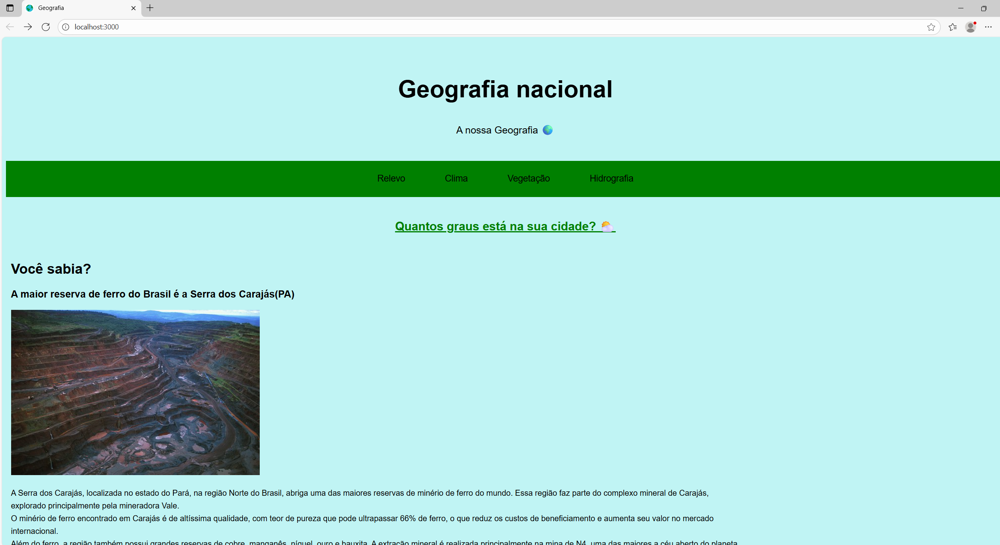

Projeto Geografia 🌍

Um portal interativo sobre a geografia do Brasil, com informações dinâmicas sobre relevo, clima, vegetação e hidrografia, incluindo uma consulta em tempo real da previsão do tempo de qualquer cidade através da API da OpenWeather.

✨ Funcionalidades
- Navegação por Abas: Visualize informações sobre Relevo, Clima, Vegetação e Hidrografia sem recarregar a página.
- API de Tempo em Tempo Real: Uma página dedicada que consome a API da OpenWeather para buscar a previsão do tempo atual.
- Busca por Cidade: A funcionalidade de tempo é interativa, permitindo que o usuário digite o nome de qualquer cidade do mundo.
- Design Responsivo: O layout se adapta a diferentes tamanhos de tela, de desktops a celulares.
- Back-end com Node.js/Express: Um servidor robusto que serve os arquivos e protege a chave da API.
- Estrutura Profissional: O código é organizado em uma estrutura de pastas src para facilitar a manutenção.

🛠️ Tecnologias Utilizadas
A construção desta caverna digital utilizou as seguintes ferramentas:
- Front-end:
. HTML5
. CSS3 (Flexbox para layouts, Media Queries para responsividade)
. JavaScript (Manipulação do DOM, Event Listeners, Fetch API)

- Back-end:
. Node.js (Ambiente de execução)
. Express.js (Framework para o servidor e rotas)
. Axios (Cliente HTTP para fazer chamadas à API externa)

- Ferramentas de Desenvolvimento:
. nodemon: Para reiniciar o servidor automaticamente durante o desenvolvimento.
. git e GitHub: Para controle de versão.

📁 Estrutura do Projeto
O projeto segue uma estrutura organizada para separar as responsabilidades:

PROJETO-GEOGRAFIA/
├── node_modules/
├── src/
│   ├── assets/
│   │   ├── img/
│   │   └── terra.ico
│   ├── css/
│   │   ├── style.css
│   │   └── sobre.css
│   ├── js/
│   │   ├── script.js
│   │   └── sobre.js
│   └── views/
│       ├── index.html
│       └── sobre.html
│
├── .gitignore
├── package.json
├── package-lock.json
└── server.js

🚀 Como Executar o Projeto
Para explorar esta caverna em sua própria máquina, siga os passos abaixo:

1. Pré-requisitos:
- Você precisa ter o Node.js instalado (que já inclui o npm).

2. Clone o Repositório:

git clone https://github.com/seu-usuario/projeto-geografia.git
cd projeto-geografia

3. Instale as Dependências:
- Este comando instalará o Express, Axios e Nodemon listados no package.json.

npm install

4 . Adapte o server.js para usar o .env:
- Instale um pacote para ler o arquivo .env: npm install dotenv
- No topo do seu server.js, adicione: require('dotenv').config();
- Onde você define a apiKey, mude para: const apiKey = process.env.API_KEY;

5. Inicie o Servidor:
- Este comando usa o atalho "dev" que configuramos no package.json para iniciar o servidor com o nodemon.

npm run dev

6. Acesse no Navegador:
Abra seu navegador e visite http://localhost:3000.

